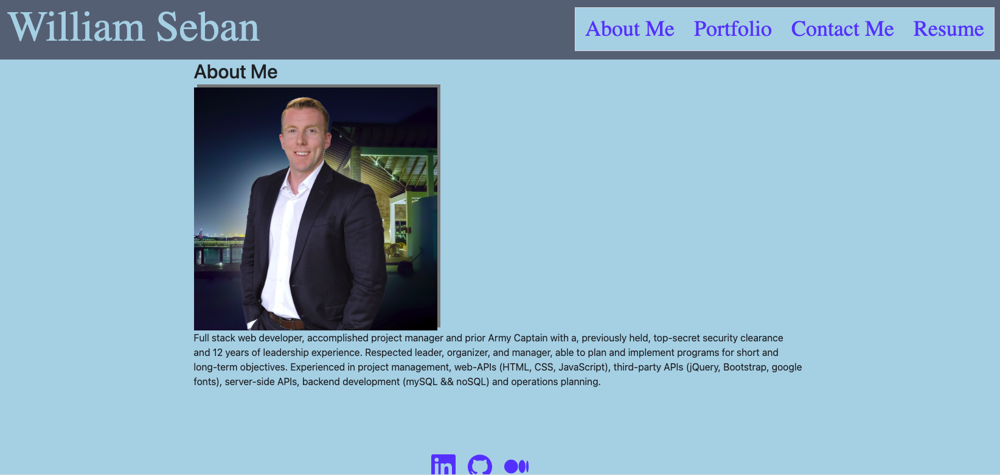
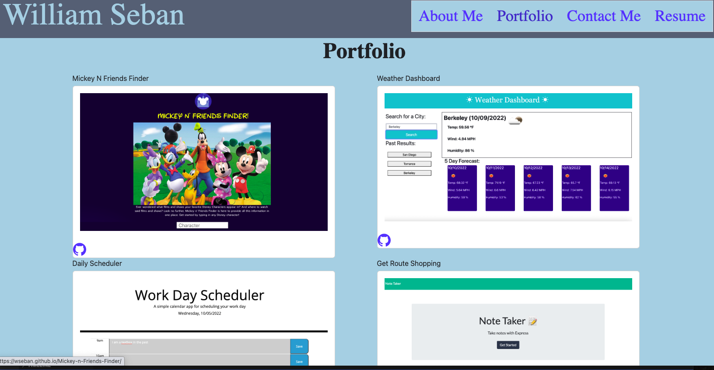
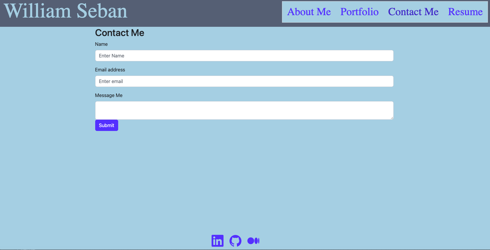
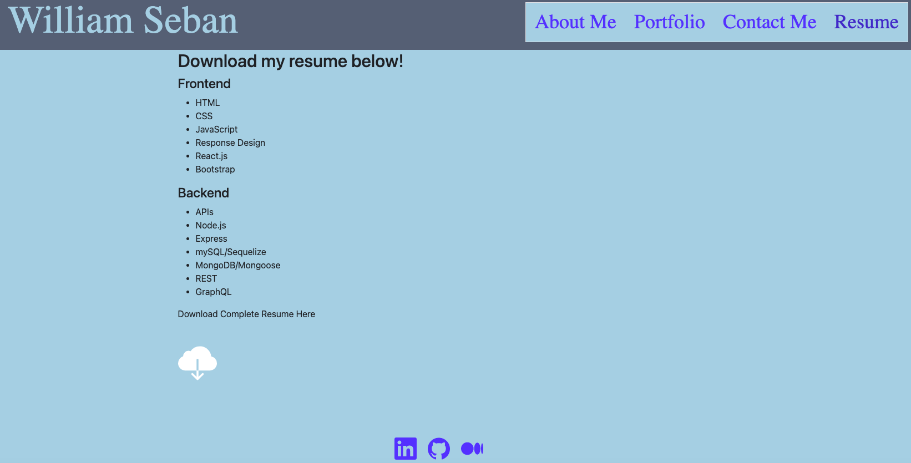

# Portfolio-WilliamS

## Deployed Link:
https://wseban.github.io/Portfolio-WilliamS/


 






## Usage
This application is for the use of employers looking for a motivated and talented full stack software engineer to fill a position in their company.  Upon clicking the deployed link the user will be introduced to who I am as a developer and my prior work history.  When the user clicks on "Portfolio" at the top of the page, the main component will change to allow the user to admire some of my developing work; these cards are clickable and will reroute you to the project's active deployed link or, if the user desires, can click the Github symbol, within each card, to be rerouted to the project's individual repository.  
If the user likes what they see and would like to communicate with me, click the "Contact Me" and fill out the form.  This form is 100% usable and will email me using emailJS.
Clicking "Resume" will give the user an opportunity to download my full resume.
If the user desires more research before starting a dialogue, the bottom has three clickable symbols leading to Linkedin, GitHub and Medium.
Thank you for taking the time to browse my portfolio!

## Technologies Used
- React - A Javascript library for building user interfaces.
- Node.js - An asynchronous event-driven program to run Javascript.
- JavaScript - Allows developer to make static webpages dynamic and interactive.  For this exercise it was used to alter the original webpage to change the questions, change the answers, add a dynamic timer/countdown(that also ends the game), as well as, allow saving of scores.
- Git - Git is what I used to work on my personal computer and pushing my work to GitHub.
- GitHub - A cloud based repository that holds my saved code reserved for resetting my personal computer deployment.

## Description

The purpose of this project was to utilize our skills with ReactJS to set up an interactive portfolio.  This portfolio application was a great way for us to show our skills by not only linking prior work, but using this application as an example piece as well.

## Installation

No installation required if using deployed link...
On developer level, run "npm install" as the root.  Before deploying run "npm run deploy" to ensure a proper build is compiled.

## Lessons Learned
The most effective lessons learned for me were...
1. Handling statefull changes and linking it with EmailJS.  
2. Inline styling with React.
3. Using React to make items downloadable.


## Code Snippets
JavaScript
```javaScript
 export default function Contact() {

  const [formState, setFormState] = useState({ name: "", email: "", message: "" });
  const [show, setShow] = useState(false);

  const handleClose = () => setShow(false);
  const handleShow = () => setShow(true);

  const handleInputChange = (e) => {
    console.log(e.target.name)
    console.log(e.target.value)
    setFormState({ ...formState, [e.target.name]: e.target.value });
    console.log(formState)

  };
  const handleFormSubmit = (e) => {
    e.preventDefault();
    console.log(formState.email)

    console.log(validateEmail(formState.email))
    if (!validateEmail(formState.email) || !formState.message || !formState.name) {
      return handleShow()
    }
    setFormState({ email: "", name: "", message: "" })
    console.log(formState)
    emailjs.send('default_service', 'template_dsjx25m', {formState}, 'C8S5M9CyzbHsWjtS2')
      .then(function (response) {
        console.log('SUCCESS!', response.status, response.text);
      }, function (error) {
        console.log('FAILED...', error);
      });

```
```JavaScript
<div style={{ maxWidth: "1000px", margin: "0 auto", height: '75vh' }}>
```
```JavaScript
import MyPDF from '../../resume/myResume.pdf';
 <p>Download Complete Resume Here</p>
      <a style={{fontSize: "70px"}} href={MyPDF} download="myResume.pdf"> <IoIosCloudDownload/> </a>
```

## Credits

NA

## License
Please refer to the LICENSE in the Repo.